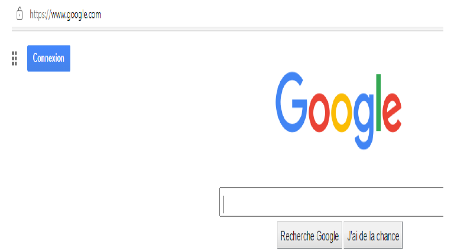
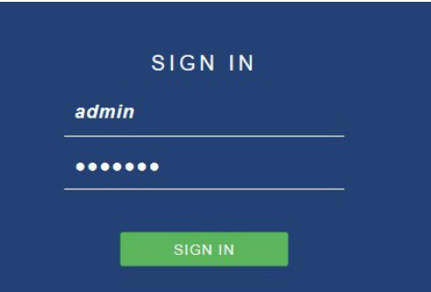
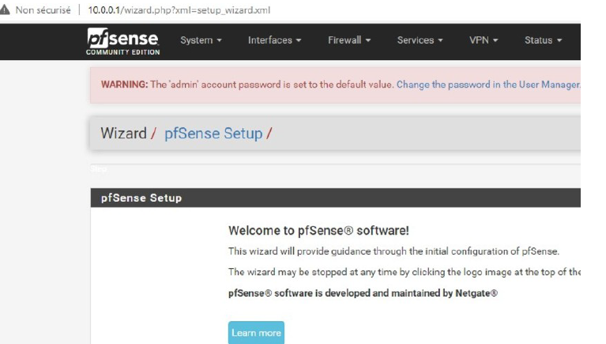
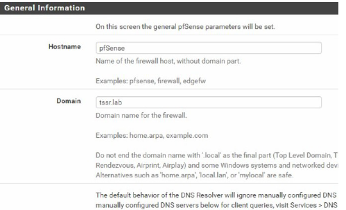
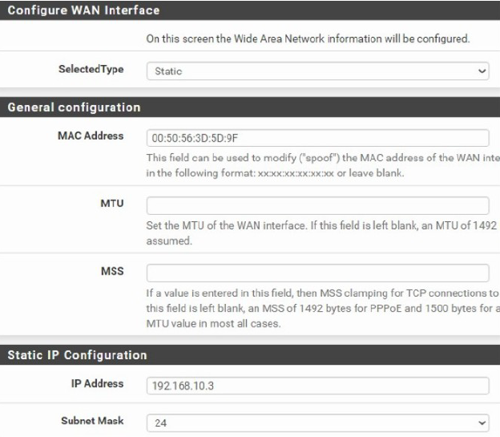
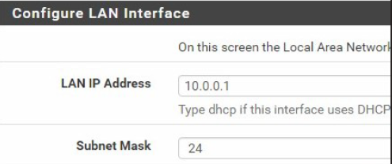
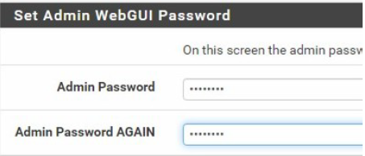
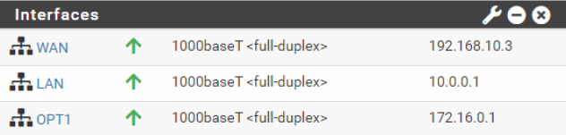

# II. Installation et configuration de pfSense

## 1. Configuration des interfaces
L'installation de pfSense suit le processus basique. Une fois l'installation terminée, nous arrivons sur le menu principal permettant la configuration des interfaces.

> **Captures de l'installation :**
> 
> 

### Assignation des interfaces et IP
Pour configurer notre architecture, nous suivons les étapes suivantes :
1. Nous appuyons sur **« 1 »** pour assigner les interfaces physiques.
2. Nous appuyons sur **« 2 »** pour configurer les adresses IP du **WAN**, du **LAN**, et de la **DMZ** (qui garde le nom par défaut `OPT1` pour le moment).

Voici le résultat de la configuration :

> **Captures de configuration IP :**
> 
> 
> 
> 
> 

## 2. Réalisation de tests via le protocole ICMP
Pour valider notre configuration, nous utilisons une machine cliente **Microsoft Windows 10** placée dans le réseau **LAN**.

### Vérification du réseau
La machine doit être capable de joindre l'interface web d'administration de pfSense. Nous commençons par vérifier les paramètres réseau de la machine avec la commande `ipconfig /all`.

> **Captures des tests Windows 10 :**

> 
> 
> 

## 3. Connexion à l’interface web (LAN)

Une fois le réseau configuré, l'administration se fait via l'interface graphique depuis la machine cliente Windows 10.

### Accès à l'interface
Nous ouvrons un navigateur web et entrons l'adresse IP du LAN de pfSense (`10.0.0.1`).

### Authentification
Pour la première connexion, nous utilisons les identifiants par défaut de pfSense :
* **Utilisateur :** `admin`
* **Mot de passe :** `pfsense`

### Assistant de configuration (Setup Wizard)
Après la connexion, pfSense lance un assistant pour finaliser les paramètres système.

Nous renseignons ensuite les informations d'identité du routeur ainsi que les serveurs DNS pour la résolution de noms.
* **Hostname :** (ex: pfSense)
* **Domain :** (ex: tssr.lab)
* **DNS :** 10.0.0.1 (DNS externes comme 1.1.1.1)

## 4. Vérification et sécurisation finale

### Validation des interfaces WAN et LAN
L'adresse WAN ayant été configurée précédemment via le Shell, nous validons ici que les paramètres ont bien été repris par l'interface Web.

Il en va de même pour l'interface LAN, qui servira de passerelle pour nos clients internes.

### Sécurisation de l'accès
Par mesure de sécurité, nous procédons immédiatement à la modification du mot de passe de l'administrateur (`admin`) pour remplacer celui par défaut.

### État actuel de l'infrastructure
Voici le tableau de bord récapitulatif après cette première phase de configuration. 

> **Note :** On s'aperçoit à ce stade que si le WAN et le LAN sont opérationnels, la **DMZ** (visible sous le nom `OPT1`) reste encore à être configurée au niveau de l'adressage et de son nommage définitif.

## 5. Création et configuration de la zone DMZ

La DMZ (Demilitarized Zone) est essentielle pour isoler notre serveur Web du reste du réseau local (LAN). 

### Configuration de l'interface
Nous nous rendons dans le menu **Interfaces > OPT1**. Pour rendre l'administration plus claire, nous effectuons les modifications suivantes :
1. **Description :** Changement du nom par défaut `OPT1` en **DMZ**.
2. **Configuration IPv4 :** Nous vérifions que l'adresse IP de la passerelle (l'interface du pfSense côté DMZ) correspond bien à notre plan d'adressage (`172.16.0.1/24`).

Une fois ces modifications appliquées, la DMZ est officiellement active et prête à recevoir les règles de filtrage pour sécuriser les flux entrants et sortants.

---

## 6. Configuration des services réseau (LAN)

### Serveur DHCP
Afin d'automatiser l'adressage sur le réseau local, nous configurons pfSense comme serveur DHCP unique pour l'interface LAN.
* **Plage d'adresses (Scope) :** `10.0.0.50` à `10.0.0.100`
* **Passerelle :** `10.0.0.1`

### Résolution de noms (DNS Resolver)
Nous configurons le **DNS Resolver** (Unbound) pour que pfSense assure la résolution de noms sur le LAN. 
1. Activation du service sur l'interface LAN.
2. Activation de l'option de résolution pour les clients DHCP (permet de résoudre les noms d'hôtes locaux).

## 7. Tests de connectivité et validation (ICMP)

### Validation du bail DHCP
Après avoir désactivé le serveur DHCP de VMware Workstation (VMnet10) pour éviter les conflits, nous renouvelons l'adresse IP sur la machine cliente Windows 10. La commande `ipconfig /all` confirme que pfSense (`10.0.0.1`) a bien attribué une adresse dans la plage prévue.

### Tests de communication
Pour valider l'ensemble de la pile réseau (L1 à L7), nous effectuons une série de pings :

1. **Ping de la passerelle :** Vérifie la connectivité locale avec pfSense.
   
2. **Ping DNS Cloudflare (1.1.1.1) :** Vérifie l'accès à l'Internet extérieur (routage/NAT).
   
3. **Résolution Google.com :** Vérifie que le résolveur DNS de pfSense fonctionne correctement.
   

